# 🛠 How It Works: EventStream E2E Validator

This document explains the internal workflow of the **EventStream E2E Validator** framework. The goal is to ensure that user actions on the frontend correctly trigger the expected backend events in a Kafka-based microservices architecture.

## 🔄 High-Level Workflow

The framework bridges the gap between **UI interactions** and **backend event streams**. It works by coordinating a UI test (Playwright) with a backend event listener (Kafka Consumer).

### Architecture Diagram

```mermaid
sequenceDiagram
    participant User as 👤 User / Playwright
    participant UI as 🖥️ UI / Application
    participant Producer as 📦 Event Producer
    participant Kafka as 🐘 Kafka Topic
    participant Consumer as 🎧 Test Consumer
    participant Validator as ✅ Schema Validator

    User->>UI: Performs Action (e.g., "Place Order")
    UI->>Producer: Triggers Backend Event
    Producer->>Kafka: Publishes Event (JSON)
    
    par Parallel Verification
        User->>UI: Verifies UI Success Message
        Consumer->>Kafka: Listens for new messages
    end

    Kafka-->>Consumer: Delivers Event Payload
    Consumer->>Validator: Validates against Schema (AJV)
    Validator-->>Consumer: Validation Result (Pass/Fail)
    
    Consumer-->>User: Returns Event Data for Assertion
```

---

## 🧩 Key Components

### 1. Playwright (The Trigger)
*   **Role**: Simulates user behavior.
*   **Action**: Clicks buttons, fills forms, and navigates the application.
*   **Example**: A test script logs into the app and clicks "Buy Now".

### 2. Kafka Producer (The Source)
*   **Role**: Represents the application's backend logic.
*   **Action**: When the UI action happens, this component constructs a JSON event and sends it to a specific Kafka topic (e.g., `order.events`).
*   **Note**: In this test framework, we may simulate this using a `producer.ts` script if the real backend isn't connected.

### 3. Kafka Consumer (The Listener)
*   **Role**: Acts as the verification agent.
*   **Action**: It subscribes to the relevant Kafka topics *before* the UI action is performed to ensure no events are missed. It waits for a specific message that matches the expected criteria (e.g., matching `orderId`).

### 4. AJV Schema Validator (The Enforcer)
*   **Role**: Ensures data integrity.
*   **Action**: Checks the received JSON payload against a strict schema (defined in `schema/order.schema.json`).
*   **Checks**:
    *   Are all required fields present?
    *   Are data types correct (e.g., `price` is a number, not a string)?
    *   does the structure match the contract?

---

## 🚀 Step-by-Step Execution Flow

1.  **Setup**:
    *   The test starts.
    *   A Kafka consumer is initialized and subscribes to the target topic.
    *   Docker containers for Kafka and Zookeeper are ensured to be running.

2.  **Action**:
    *   Playwright launches the browser.
    *   The test script performs the business logic (e.g., creating a new user or order).

3.  **Capture**:
    *   As the action completes, an event is fired to Kafka.
    *   The test framework's consumer catches this event in real-time.

4.  **Validation**:
    *   The payload is parsed.
    *   **Schema Validation**: Is the JSON valid?
    *   **Data Validation**: Does `event.amount` match the value entered in the UI?

5.  **Assertion**:
    *   If the event is missing, invalid, or incorrect, the Playwright test fails.
    *   If everything matches, the test passes.
